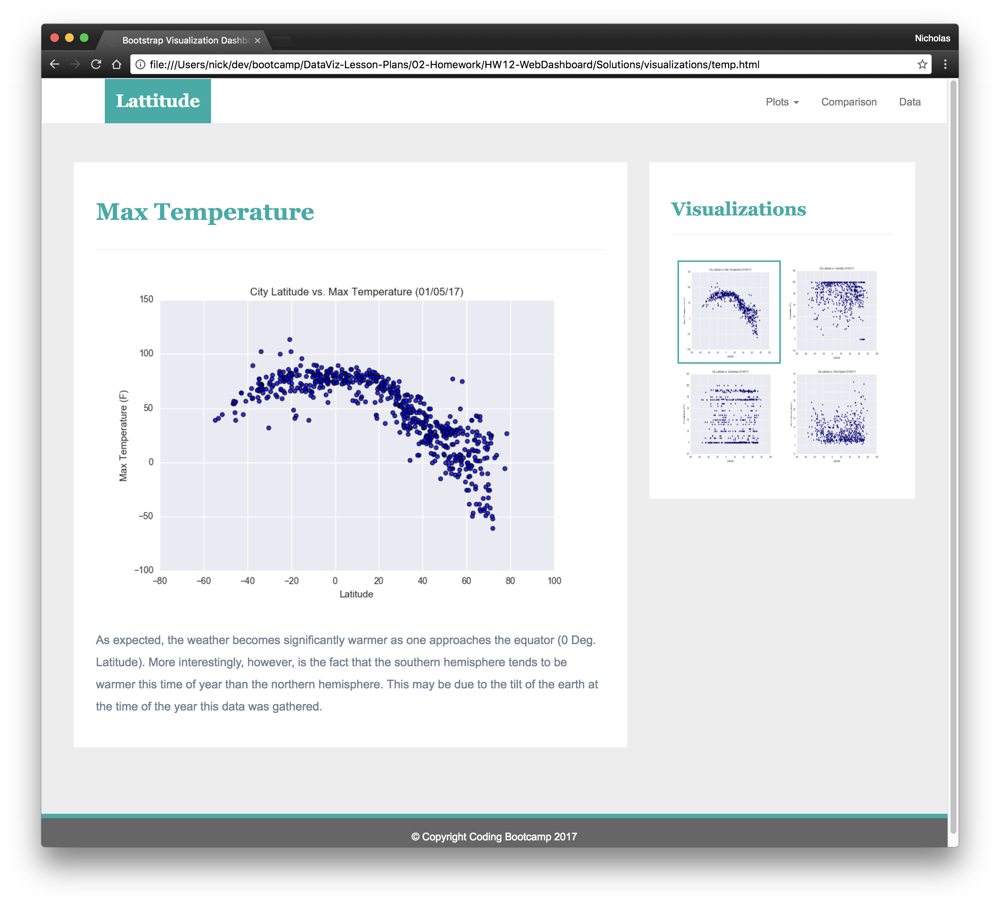
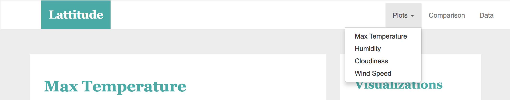

# Web Visualization Dashboard (Latitude)
- Background: Data is more powerful when we share it with others! 
## Overview: 
- Problem: Creates a visualization dashboard website. Users can navigate individual pages for each plot. These pages contain the visualizations and their corresponding explanations. Also has a landing page, where users can see a comparison of all of the plots, and another page where we the data used to build the plots can easily be viewed.
- Organization: Uses HTML, JavaScript, and Bootstrap to create responsive web pages.
- How to run: Run the HTML web page in a browser.
- Deployed app: https://axyperrary.github.io/Assignment-11/
- Screenshots:

